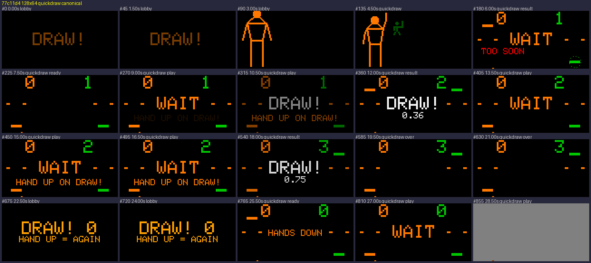
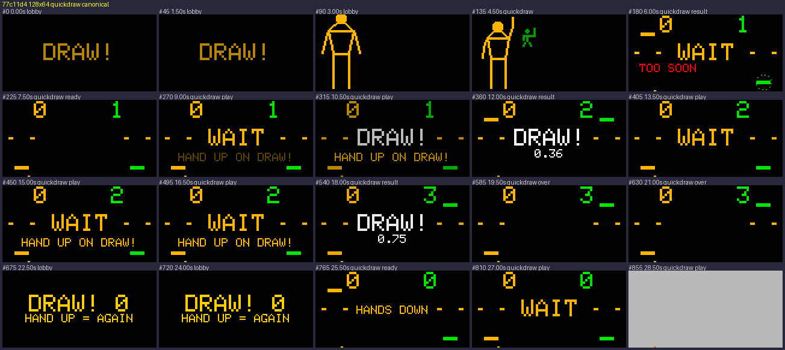
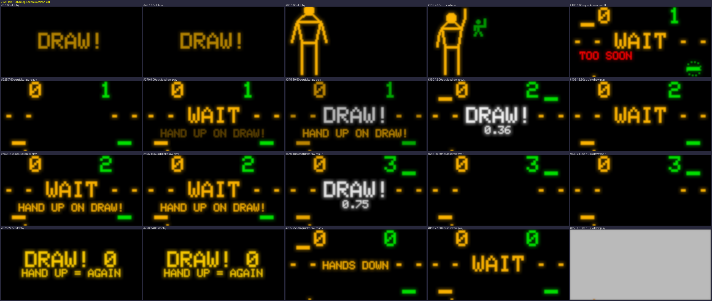
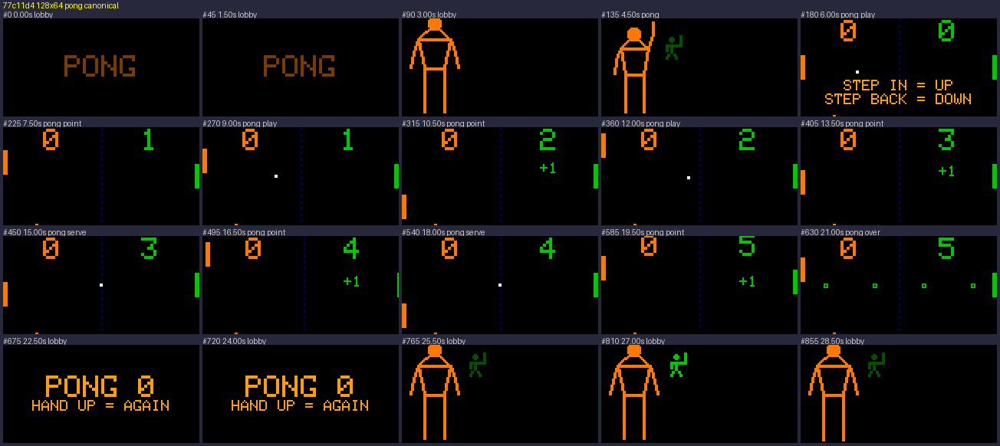
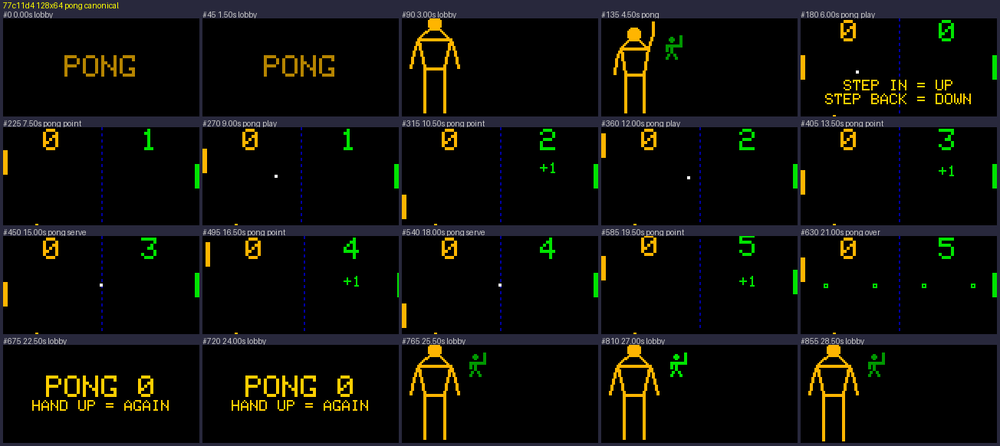
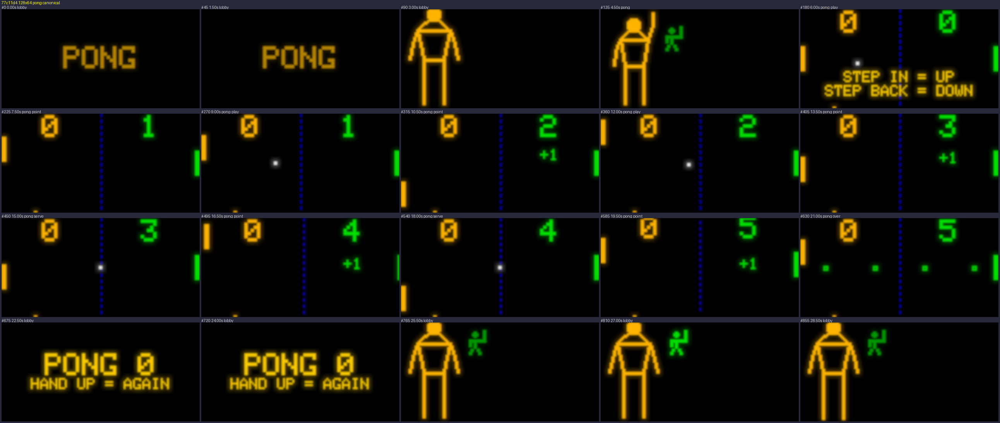

# Evidence 77c11d4

## quickdraw

### 128x64

| metric | value | budget | ok |
| --- | --- | --- | --- |
| response_ticks | 1.0 | - to 2.0 | yes |
| response_px | 72.0 | 12.0 to - | yes |
| fidelity | 0.9891 | 0.8 to - | yes |
| range | 0.6349 | 0.6 to - | yes |
| lit_fraction | 0.0794 | 0.01 to 0.5 | yes |
| dim_fraction | 0.0119 | - to 0.1 | yes |
| liveliness | 0.0122 | 0.001 to - | yes |
| flash_area_raw | 0.0 | - to 0.1 | yes |
| square_flashes | 2.0 | - to 6.0 | yes |
| score_visible | 0.9784 | 0.8 to - | yes |
| score_legible | 1.0 | 0.9 to - | yes |
| presence_answer_seconds | 1.9667 | - | - |
| win_good | 1.0 | 0.7 to - | yes |
| win_lazy | 0.45 | 0.1 to 0.7 | yes |
| win_none | 0.0 | - to 0.05 | yes |
| round_seconds | 20.9833 | 20.0 to 120.0 | yes |
| phases_reached | 1.0 | 1.0 to - | yes |

## pong

### 128x64

| metric | value | budget | ok |
| --- | --- | --- | --- |
| response_ticks | 1.0 | - to 2.0 | yes |
| response_px | 12.0 | 12.0 to - | yes |
| fidelity | 0.9947 | 0.8 to - | yes |
| range | 0.6287 | 0.6 to - | yes |
| lit_fraction | 0.039 | 0.01 to 0.5 | yes |
| dim_fraction | 0.1147 | - to 0.3 | yes |
| liveliness | 0.0035 | 0.001 to - | yes |
| flash_area_raw | 0.0 | - to 0.1 | yes |
| square_flashes | 0.0 | - to 6.0 | yes |
| score_visible | 1.0 | 0.8 to - | yes |
| score_legible | 1.0 | 0.9 to - | yes |
| presence_answer_seconds | 0.0 | - | - |
| win_good | 1.0 | 0.7 to - | yes |
| win_lazy | 0.25 | 0.1 to 0.7 | yes |
| win_none | 0.0 | - to 0.05 | yes |
| round_seconds | 66.0667 | 20.0 to 120.0 | yes |
| phases_reached | 1.0 | 1.0 to - | yes |

